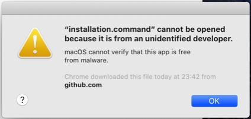

# YouTubeDownloader


This is an application for downloading videos from YouTube in all available resolutions.

A lot of people trying to download 1080p or 4k videos from YouTube end up getting a silent video. The reason is that YouTube now codes the video and  audio seperately for anything over 720P. (That is also the reason why many online youtube downloading platform that used to support 1080p downloading only support 720p now.)

And most of the YouTube downloading platforms (both web-base and desktop app) that support 1080p+ suck. They either charge a fee or work at an intolerably slow speed.

This application allows you to download those videos at full speed and it is totally free from any subscription or Ad.


## Development

This project is based on:

- [Python](https://www.python.org/).  An interpreted programming language.
- [youtube-dl](https://ytdl-org.github.io/youtube-dl/). A powerful command-line program for downloading videos from YouTue and a few more website.
- [FFmpeg](https://ffmpeg.org/). A complete, cross-platform program to record, convert and stream audio & video.
- **Tkinter**. Python‘s standard GUI toolkit

This application works by downloading the video and the audio saperately using **youtube-dl**, then using **FFmpeg** to merge the video and the audio. 


## Features

It support all available resolution such as 8K or 4K HDR 

You can either let the program automatically select the best format of a video for you. Or you can let it show all the formats available so you can make a choice.

The GUI of the program is very intuitive. If you can install it, you will easily find out how to use it.


## Installation

The installation script will install a few command line programs since this application is built based on them. It will skip programs that have already been installed on you machine.


### For macOS

(This app is not compatible with MacOS Catalina beta)

#### 1. Download
[Download YTBDLD for MacOS](https://github.com/yuehanui/YouTubeDownloader/raw/master/YTBDLD%20for%20MacOS.zip) and unzip it.

#### 2. Authorize the installation script to execute on your computer

Open terminal. (You can find it in the app dashboard or search for it using spotlight.)

Paste this command line in Terminal, 

```bash
chmod 755 
```

then drag the **installation.command** file into the terminal. You will see that the path of the file appended to the end of the command. Press enter to execute.


#### 3. Run the installation script

Double click to run the **installation.command** file.

You may be asked to press `Enter` to continue

You may also be asked  to enter the password of your computer. (The password won't show up on the screen when you enter. Just enter it then press `Enter`. )

> In macOS Catalina and macOS Mojave, if the file fail to open because it is from an unidentified developer,
>
> 
>
> Go to System Preferences > Security & Privacy, under the General tab. Click Open Anyway to confirm your intent to open the file.
>
> (Also apply for the **YouTubeDownloader.command** file )


**Done!**


### For Linux

#### 1. Download
[Download YTBDLD for Linux](https://github.com/yuehanui/YouTubeDownloader/raw/master/YTBDLD%20for%20Linux.zip) and unzip it.


#### 2. Authorize the installation script to execute on your computer

Paste this line in Terminal, then drag the **installation** file into the terminal. You will see that the file path appended to the end of the command. Press enter to execute.

```bash
 $ chmod 755 
```


#### 3. Run the installation script

Double click to run the **installation** file.

**Done!**


## How 2 Use

1. Open **YouTubeDownloader.command**.

2. Paste the URL of the video you intend to download.

3. > Click `Download Best Resolution` , or
   >
   > Click `Show Available Formats` to get the available formats, select the format you intend to download, then click `Download Selected`.

The video will be downloaded to the same folder.

